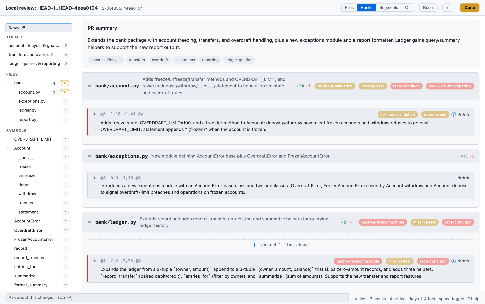
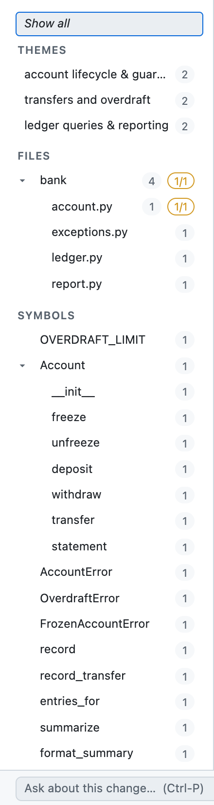
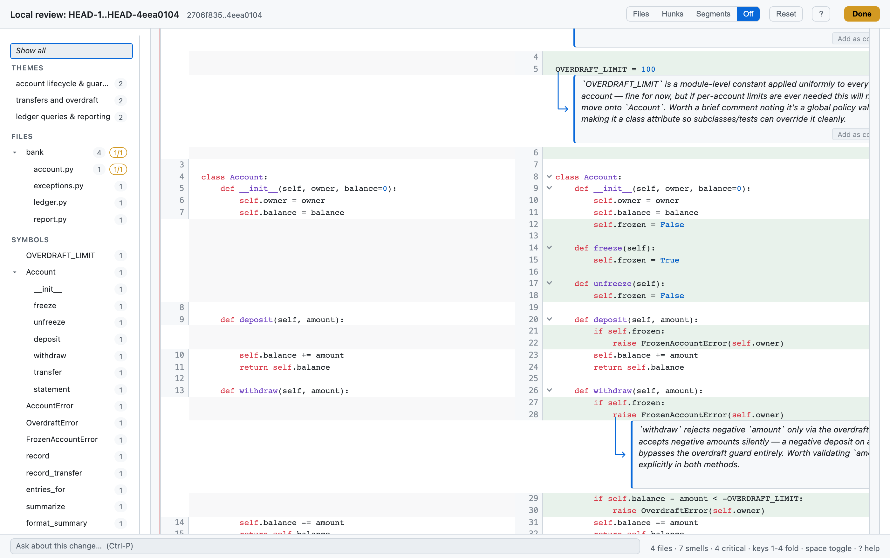
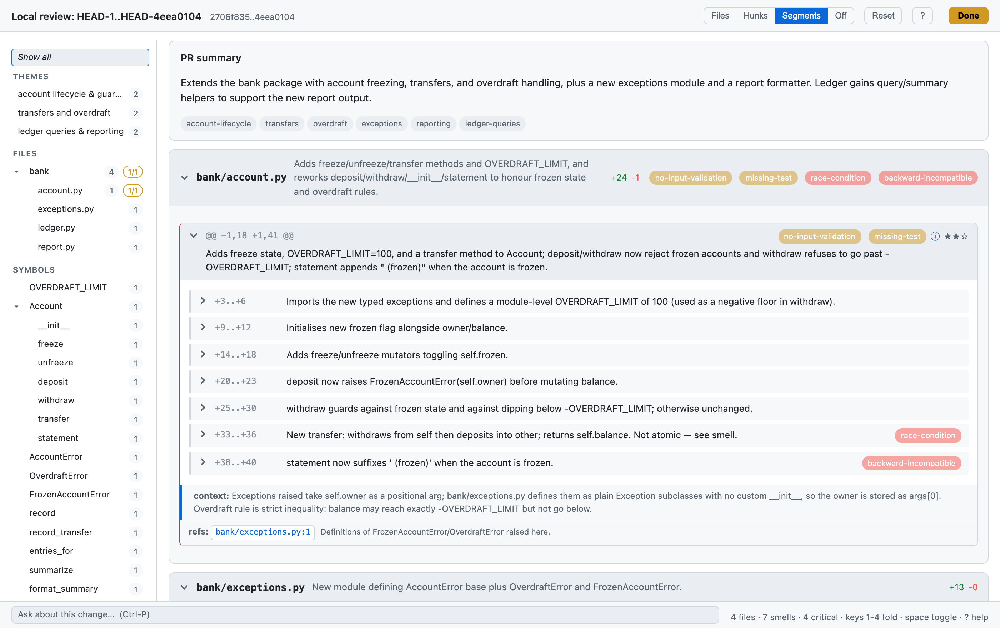
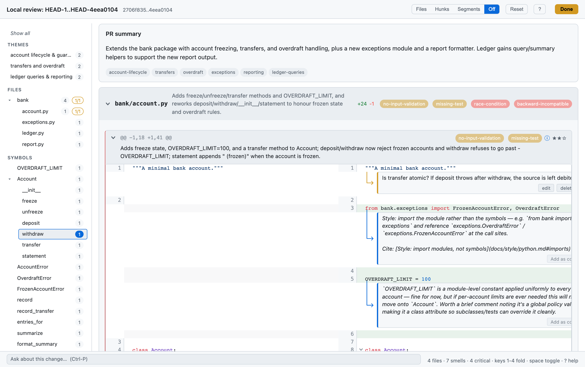
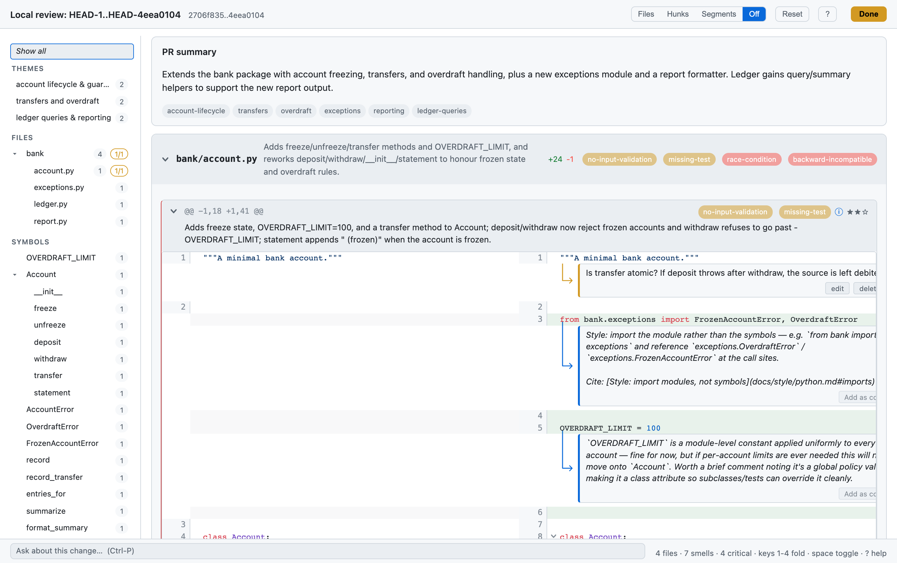
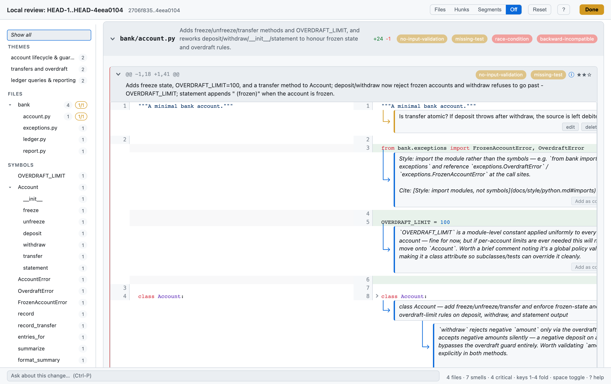
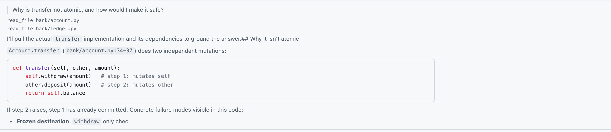

# A guided tour of the `scr` viewer

This walks through reviewing one small change with `scr`, screenshot by
screenshot, to show what every part of the viewer does. The screenshots
are a real `scr review` run (annotations produced by the LLM, not mocked).

## The change under review

A toy `bank` package. The base has a bare `Account` (deposit / withdraw)
and a one-line ledger `record`. The change under review adds a fair bit
at once — deliberately, so the viewer has something to organise:

- `bank/account.py` — an `OVERDRAFT_LIMIT` constant, a freeze/unfreeze
  flag guarding `deposit`/`withdraw`, an overdraft check, and a
  `transfer` method.
- `bank/exceptions.py` (new) — `AccountError` + `OverdraftError` /
  `FrozenAccountError`.
- `bank/ledger.py` — a wider entry tuple, `record_transfer`,
  `entries_for`, `summarize`.
- `bank/report.py` (new) — `format_summary`, `format_owner_statement`.

Reproduce the whole tour with:

```
scr review HEAD~1..HEAD          # against a branch with a change like the above
```

---

## 1. The overview



On open you get the **PR summary** the model wrote, the theme chips it
tagged, and — down the left — the grouping sidebar. Each file block shows
the model's one-line summary, the `+`/`-` counts, and any **smell** pills
(`missing-test`, `race-condition`, `backward-incompatible`, …) surfaced
for that file. The bottom bar tallies files / smells / critical smells and
reminds you of the keys.

The diff starts folded to **hunk** level: you see each hunk's header and
the model's intent sentence, not the code. The fold slider (top right,
`Files · Hunks · Segments · Off`) is the master collapse control — keys
`1`–`4` do the same. Nothing but `Off` reveals code by default.

## 2. Three ways to navigate



The sidebar offers the same change under three lenses, any pill filtering
the diff to its hunks:

- **Themes** — the overview's semantic clusters (the model grouped these
  ~six hunks into "account lifecycle & guards", "transfers and overdraft",
  "ledger queries & reporting"). Themes only appear when the model
  actually clusters; a tiny change may have none.
- **Files** — a foldable directory tree (`bank/` → the four files),
  single-child directories collapsed, siblings sorted. The amber badge is
  the unresolved/total comment count for that file.
- **Symbols** — a deterministic tree-sitter tree, `Account ▸ __init__ /
  freeze / withdraw / transfer / …` plus the module-level functions and
  the new exception classes. No LLM guesswork: it's what the code
  literally declares.

## 3. The diff itself



At `Off` the full side-by-side diff renders: syntax-highlighted, additions
tinted, intra-line change marks on edited lines. The chevrons in the gutter
are **indent folds** (see §7). The italic call-outs hanging off lines are
the model's per-line observations, each with an **Add as comment** button
that promotes it into a real reviewer comment.

## 4. Segment summaries



At **Segment** level a hunk isn't code and isn't a single blob — it's the
model's breakdown of the hunk into labelled slices (`+3..+6 Imports the
new typed exceptions…`, `+25..+30 withdraw guards against frozen state…`),
each carrying its own intent and smells. A hunk with no segments folds as
one. It's a table of contents for a large hunk; click any row to open the
hunk's code.

## 5. Focusing a symbol



Clicking a Symbols pill (here `withdraw`) filters to the hunks that touch
it and search-highlights the name across the diff. The focused hunk opens
to its code; files with nothing relevant drop away. In a file with several
hunks, the non-matching ones collapse into "expand" folds rather than
vanishing, so you can still peek. Picking a fold level while focused
re-folds everything to that depth — focus and fold depth compose.

## 6. Inline comments



Click a line number on either side to leave a comment (here, on `transfer`
atomicity). Threads render inline against their anchor line; the Files-axis
pill picks up an unresolved/total badge (`1/1` on `account.py`). When you
hit **Done**, `scr review` prints these back as markdown for the calling
agent, and `scr pr` posts them to the GitHub PR as one review.

## 7. On-demand fold summaries



The gutter chevrons collapse indent regions (a class body, a function).
The first time you collapse one, the model summarises the hidden code and
the summary stands in for it — here the whole `class Account` body reduces
to one line. Collapse to read the shape; expand to read the detail.

## 8. Asking about the change



The footer input (`Ctrl-P`) is a review console: ask a question about the
change and the model answers over the same repo tools the review pass uses
— you can see it `read_file bank/account.py` before grounding its answer
about `transfer` atomicity in the actual code. Answers stream in as
markdown.

---

## What's not shown here

- **Streaming**: on a live run the hunks fill in as the model works, with a
  progress strip up top; these shots are of the finished review.
- **`refs` and `smells`** are model-driven — they appear when the model
  cites a cross-reference or flags an issue, so a given change may show
  more or fewer than this one did.
